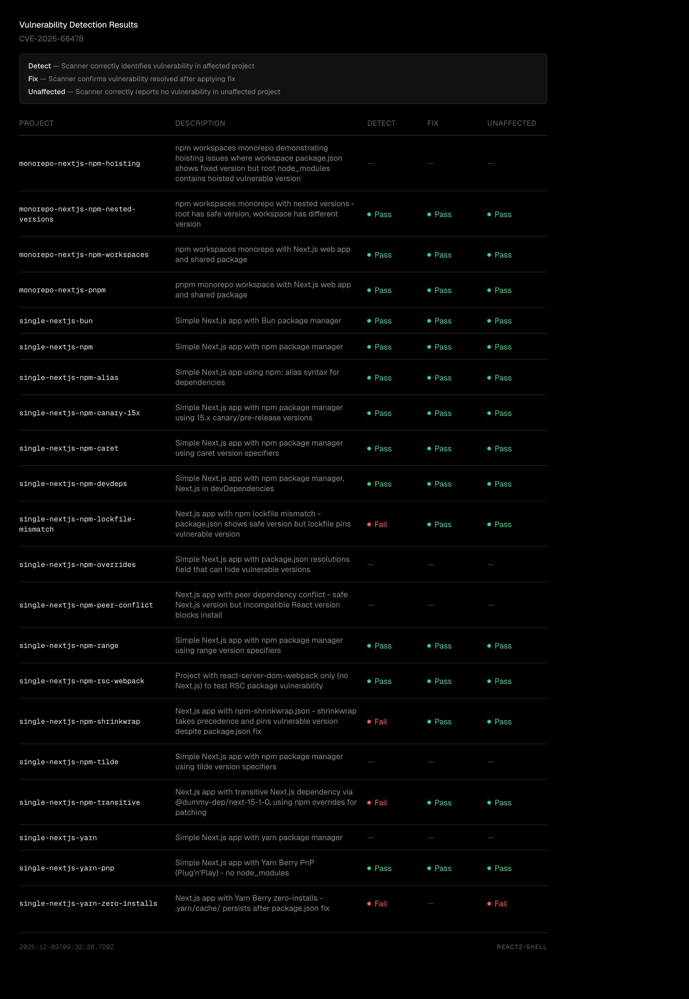

# React2Shell Repo Menagerie

<h3>This organization hosts test fixtures for validating automated security remediation tools against the CVE-2025-66478 vulnerability affecting React 19.x and Next.js 15.x/16.x.</h3>

Automated patching tools face a combinatorial explosion of project configurations:

* Different package managers (npm, pnpm, yarn, bun)
* Project structures (single packages, monorepos)
* Version specifiers (exact, caret, tilde, ranges)
* Dependency graphs (direct, transitive, dev dependencies)

Each repository in this organization represents a specific configuration scenario, allowing us to systematically verify that fixes work across the messy reality of JavaScript ecosystems.

Each repository exists in two variants: a **vulnerable** state (containing an affected package version) and a **pristine** state (after the fix has been applied). The test harness generates these repositories from templates, validates that the vulnerability scanner detects the issue in the vulnerable state, applies the fix, and confirms the pristine state passes. This ensures the remediation tool handles edge cases like transitive dependencies requiring `overrides`, aliased packages, and monorepo workspace configurations.

The table below shows current test results across all scenarios. For implementation details, generator source code, and instructions on running tests locally, see the [main](https://github.com/react2shell-repo-menagerie/main) repository.

## Test Results

